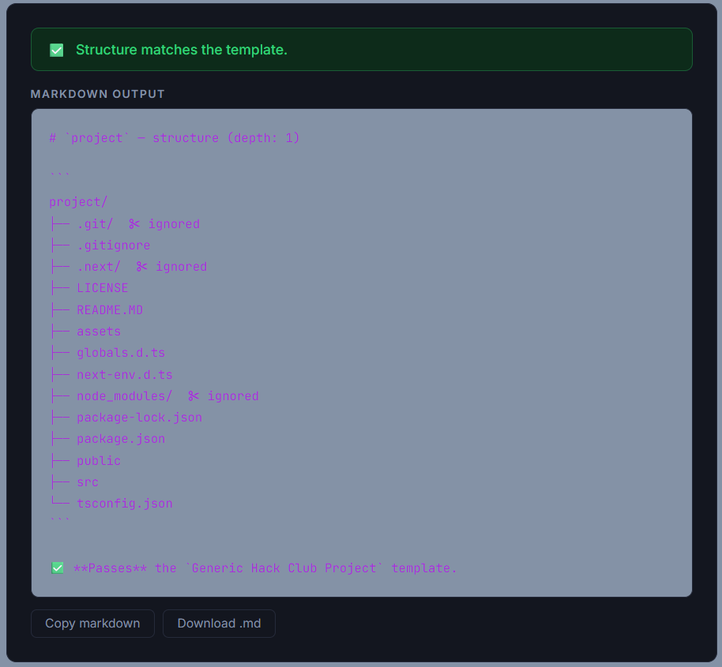

# starstruct

starstruct is an webapp that lets you drop a project folder, validates its structure against known Hack Club YSWS templates and returns a downloadable markdown tree and the result. 

## Hero

## Try it [here!](https://starstruct.z0b1.tech)

## Quick start

1. Go to the [url](https://starstruct.z0b1.tech);
2. Upload your project folder;
3. Click yes on the prompt;
4. Choose a `template`;
5. Choose depth and ignored files/folders(common files and folder like .gitignore, .vercel, __pycache__, etc. )
6. Click check structure and copy or download the `.md`.

## Features

- Web interface
- FlaskAPI
- Cool UI
- Custom User made templates
- Python

## How to run locally 
